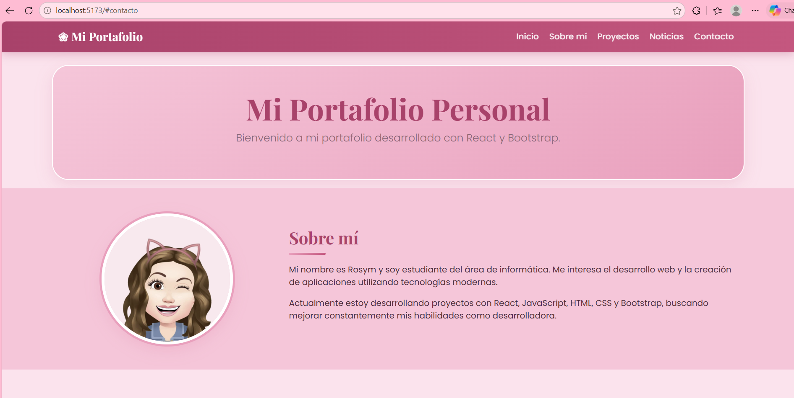
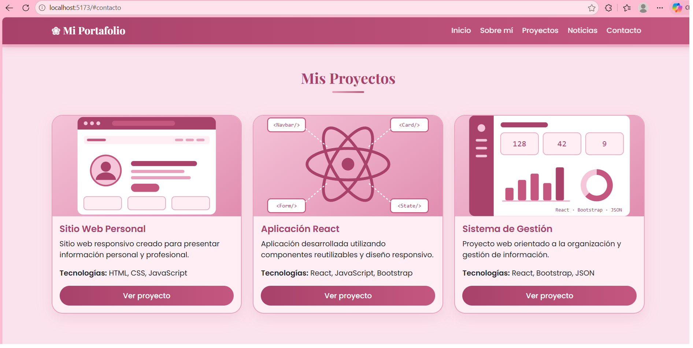
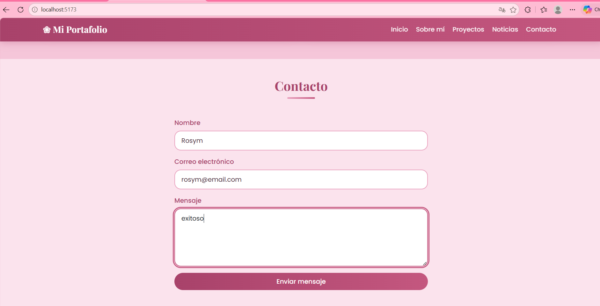
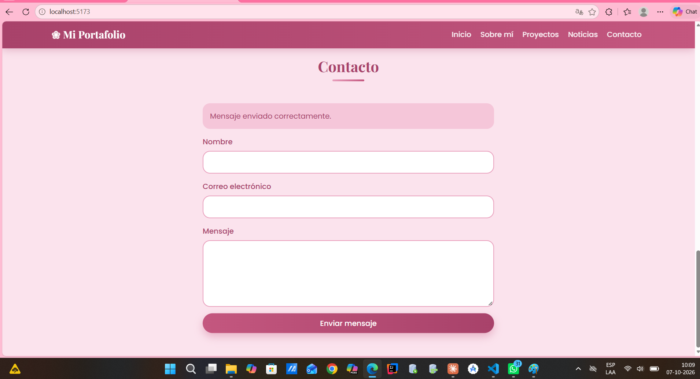
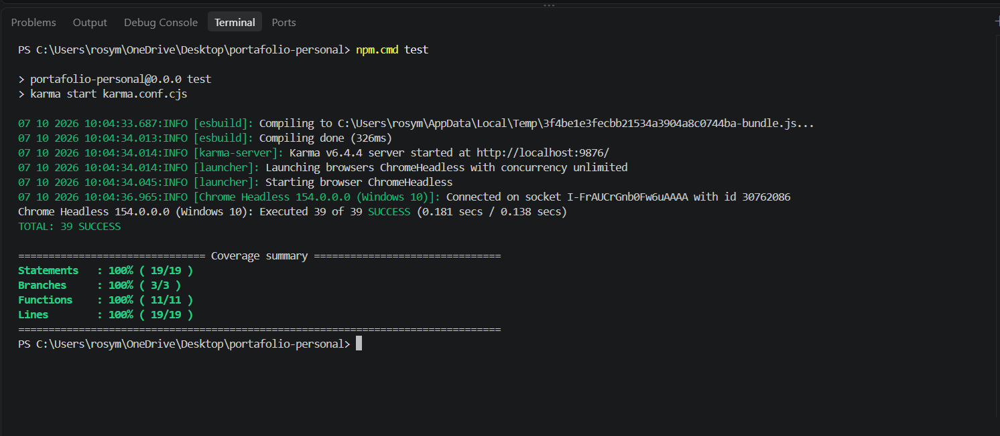
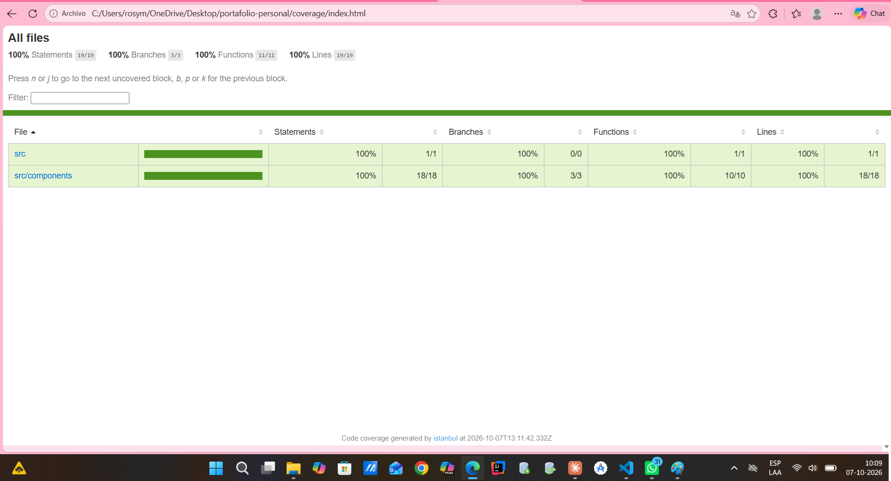

# Portafolio Personal

Portafolio personal desarrollado con **React**, **Vite** y **Bootstrap**, con pruebas unitarias en **Jasmine** y **Karma**.

Evaluación Formativa N° 2 – DSY1104 Desarrollo Fullstack II (Duoc UC).

- **Autora: Rosa Medina Garrido 
- **Repositorio:
- **Sitio publicado:

## Capturas de pantalla

### Portafolio



### Proyectos



### Ejemplo de uso: formulario de contacto

| Formulario completado | Mensaje enviado |
|---|---|
|  |  |

### Pruebas y cobertura

| Pruebas unitarias | Informe de cobertura |
|---|---|
|  |  |

## Características

- Navbar responsivo de Bootstrap, con menú colapsable en pantallas pequeñas.
- Secciones: Inicio, Sobre mí, Proyectos, Noticias y Contacto.
- Componentes React reutilizables que reciben datos por **props** (`ProyectoCard`, `Noticias`).
- Tres proyectos mostrados en tarjetas (Card) de Bootstrap, con imagen, título, descripción, tecnologías y enlace.
- Noticias cargadas desde un archivo JSON (`src/data/noticias.json`) con título, fecha y contenido.
- Formulario de contacto con validación y mensaje de confirmación (manejo de **state** y eventos).
- Accesibilidad: texto `alt` en las imágenes, `aria-label` en el botón del menú y navegación con teclado.

## Tecnologías

React 19 · Vite · Bootstrap 5 · Jasmine · Karma · Testing Library · Istanbul (cobertura)

## Requisitos

- [Node.js](https://nodejs.org/) 18 o superior
- Google Chrome (Karma usa ChromeHeadless)

## Instalación

```bash
git clone <URL-del-repositorio>
cd portafolio-personal
npm install
```

> En Windows PowerShell, si aparece un error de política de ejecución, usa `npm.cmd` en lugar de `npm`.

## Ejecución

```bash
npm run dev
```

Abre la URL que muestra la terminal (normalmente `http://localhost:5173`).

Otros comandos:

```bash
npm run build     # genera la versión de producción en dist/
npm run preview   # sirve la versión de producción
npm run lint      # revisa el código con ESLint
```

## Pruebas

```bash
npm test
```

Karma ejecuta las pruebas de Jasmine en ChromeHeadless, una sola vez, y al final muestra el resumen de cobertura.

Resultado actual: **39 pruebas, todas exitosas**.

### Informe de cobertura

Al ejecutar `npm test` se genera el informe en la carpeta `coverage/`. Para verlo:

```bash
start coverage\index.html      # Windows
open coverage/index.html       # macOS
```

Cobertura actual:

| Statements | Branches | Functions | Lines |
|---|---|---|---|
| 100% | 100% | 100% | 100% |

La cobertura se mide con `istanbul-lib-instrument` mediante un plugin de esbuild (`coverage-plugin.cjs`) y se reporta con `karma-coverage`.

### Configuración de pruebas

- **Framework de pruebas:** Jasmine (`karma-jasmine`).
- **Ejecutor:** Karma (`karma.conf.cjs`) con ChromeHeadless.
- **Compilación:** `karma-esbuild`, con JSX automático y carga de imágenes como `dataurl`.
- **Utilidades de DOM:** `@testing-library/react` (`render`, `screen`, `fireEvent`).
- **Mock:** en `Noticias` se pasan noticias simuladas por props para probar el componente sin depender del JSON real.

Los archivos de prueba (`*.spec.js`) están junto a cada componente.

## Plan de pruebas

Cada caso indica el componente, qué se verifica y el resultado esperado. Todos los casos están implementados y pasan.

### Contacto (`Contacto.spec.js`)

| N° | Caso de prueba | Resultado esperado |
|---|---|---|
| 1 | Renderizar el componente | Se muestra el título "Contacto" |
| 2 | Revisar los campos del formulario | Existen los campos Nombre, Correo electrónico y Mensaje |
| 3 | Estado inicial | No se muestra el mensaje de éxito al cargar |
| 4 | Escribir en el campo Nombre | El valor del campo se actualiza con lo escrito |
| 5 | Completar y enviar el formulario | Aparece "Mensaje enviado correctamente." |

### Proyectos (`Proyectos.spec.js`)

| N° | Caso de prueba | Resultado esperado |
|---|---|---|
| 6 | Renderizar la sección | Se muestra el título "Mis Proyectos" |
| 7 | Listado de proyectos | Se muestran los tres proyectos por su título |
| 8 | Descripciones | Se muestra la descripción de cada proyecto |
| 9 | Tecnologías | Se muestran las tecnologías de cada proyecto |
| 10 | Imágenes | Se renderizan 3 imágenes (una por proyecto) |
| 11 | Enlaces | Se renderizan 3 enlaces con el `href` correcto |

### ProyectoCard (`ProyectoCard.spec.js`)

| N° | Caso de prueba | Resultado esperado |
|---|---|---|
| 12 | Título recibido por props | Se muestra como encabezado |
| 13 | Descripción y tecnologías por props | Se muestran los textos recibidos |
| 14 | Imagen | Tiene `src` correcto y `alt` descriptivo |
| 15 | Enlace | Tiene `href` correcto, `target="_blank"` y `rel` con `noopener` |
| 16 | Reutilización | Con otras props muestra otros datos y no los anteriores |

### Noticias (`Noticias.spec.js`)

| N° | Caso de prueba | Resultado esperado |
|---|---|---|
| 17 | Renderizar la sección | Se muestra el título "Noticias" |
| 18 | Datos del JSON | El JSON contiene al menos dos noticias |
| 19 | Tarjetas | Hay una tarjeta por cada noticia del JSON |
| 20 | Contenido | Se muestran título, fecha y contenido de cada noticia |
| 21 | Estructura del JSON | Cada noticia tiene título, fecha y contenido |
| 22 | Mock por props | Se renderizan las 3 noticias simuladas recibidas |
| 23 | Lista vacía | No se muestran tarjetas y el título se mantiene |

### SobreMi (`SobreMi.spec.js`)

| N° | Caso de prueba | Resultado esperado |
|---|---|---|
| 24 | Renderizar la sección | Se muestra el título "Sobre mí" |
| 25 | Biografía | Se muestran los párrafos de presentación |
| 26 | Foto de perfil | La imagen tiene `src` y texto alternativo |
| 27 | Ancla de navegación | La sección tiene el id `sobre-mi` |

### Navbar (`Navbar.spec.js`)

| N° | Caso de prueba | Resultado esperado |
|---|---|---|
| 28 | Marca | Se muestra "Mi Portafolio" con enlace a `#inicio` |
| 29 | Enlaces del menú | Se muestran Inicio, Sobre mí, Proyectos, Noticias y Contacto |
| 30 | Destinos | Cada enlace apunta a su sección (`#inicio`, `#sobre-mi`, etc.) |
| 31 | Cantidad de enlaces | Hay 6 enlaces (marca + 5 secciones) |
| 32 | Botón del menú | Es accesible (`aria-label`) y controla el colapso |
| 33 | Menú colapsable | Existe el elemento con el id que referencia el botón |
| 34 | Responsividad | Usa las clases `navbar` y `navbar-expand-lg` de Bootstrap |

### App (`App.spec.js`)

| N° | Caso de prueba | Resultado esperado |
|---|---|---|
| 35 | Encabezado principal | Se muestra el título y el mensaje de bienvenida |
| 36 | Sección de inicio | Existe el id `inicio` usado por el Navbar |
| 37 | Secciones | Se renderizan Navbar, Sobre mí, Proyectos, Noticias y Contacto |
| 38 | Navegación | Cada enlace del Navbar apunta a una sección existente |
| 39 | Estructura | El contenido está dentro de un elemento `main` |

## Estructura del proyecto

```
portafolio-personal/
├── docs/                    # capturas de pantalla para el README
├── public/
├── src/
│   ├── assets/              # imágenes
│   ├── components/
│   │   ├── Contacto.jsx / Contacto.spec.js
│   │   ├── Navbar.jsx / Navbar.spec.js
│   │   ├── Noticias.jsx / Noticias.spec.js
│   │   ├── ProyectoCard.jsx / ProyectoCard.spec.js
│   │   ├── Proyectos.jsx / Proyectos.spec.js
│   │   └── SobreMi.jsx / SobreMi.spec.js
│   ├── data/
│   │   └── noticias.json    # noticias cargadas dinámicamente
│   ├── App.jsx / App.spec.js
│   └── main.jsx
├── coverage-plugin.cjs      # instrumentación para cobertura
├── karma.conf.cjs           # configuración de Karma
└── package.json
```
